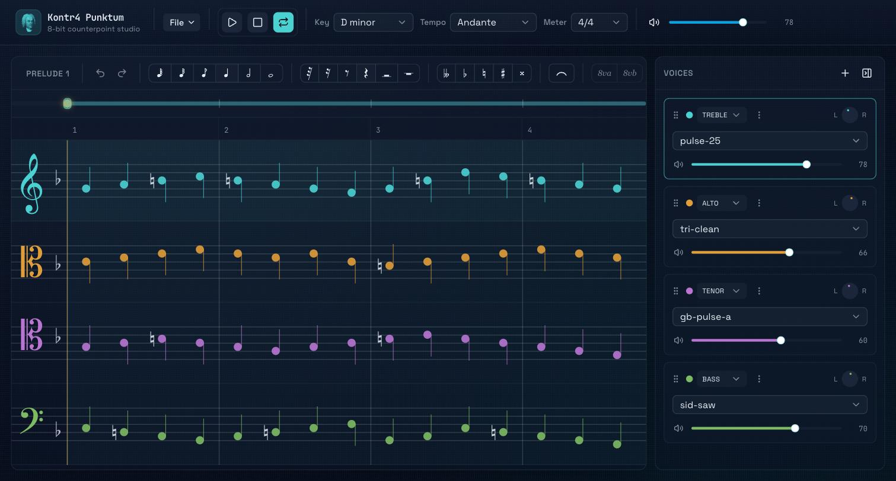
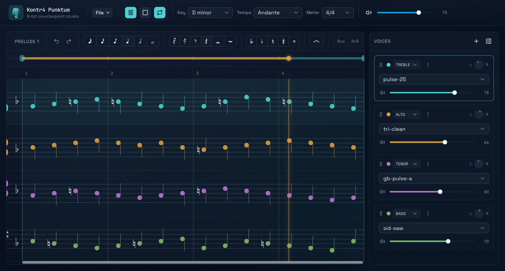
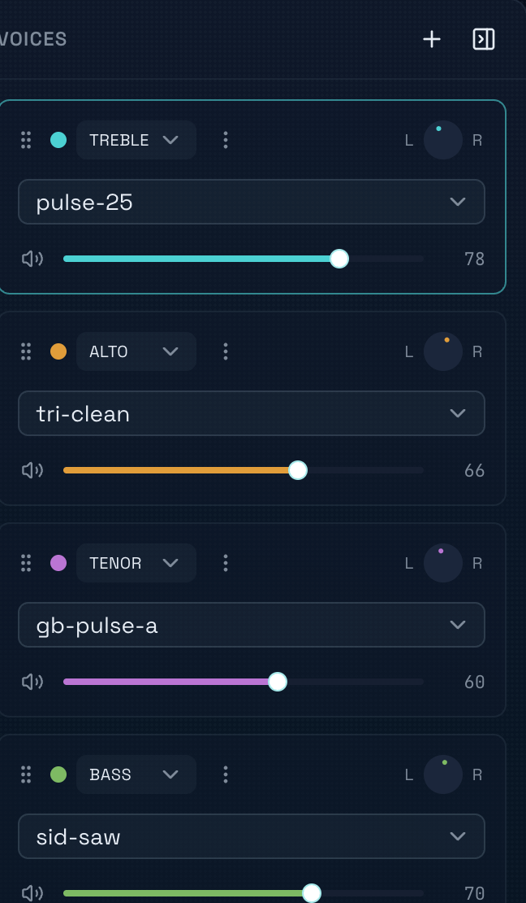

# Kontr4 Punktum

**8-bit counterpoint studio** — a staff-notation editor for composing contrapuntal classical music, played back in real time through a chiptune synth engine built on the Web Audio API.

Write four independent voices in standard notation, pick a NES/Game Boy/SID/FM-style patch for each one, and hear your counterpoint the way an 8-bit sound chip would have played it.



## Features

- **Real staff notation** — treble, alto, tenor, and bass clefs with key signatures, time signatures, accidentals, ties, dotted rhythms, and octave shift brackets, rendered with genuine Unicode music glyphs.
- **Multi-voice composition** — add, remove, reorder, mute, or solo voices; each one gets its own clef, synth preset, volume, and pan.
- **39 chiptune synth presets** across 9 categories — pulse/square, triangle, sawtooth, NES, Game Boy, SID (C64), FM synthesis, bells & chimes, and lo-fi/noise — all synthesized live with Web Audio, no samples.
- **Keyboard-driven note entry** — a step-time keymap (letter names for pitch, digits for duration, arrows to nudge and navigate) for fast, mouse-free composing, alongside click-to-place entry on the staff.
- **Transport with loop region** — scrub playback, drag a loop's start/end handles independently, and loop indefinitely while you refine a passage.
- **Undo/redo history** scoped to actual notation edits.
- **Collapsible voice mixer** with per-voice mute/solo, volume, and pan.





## Note-entry keymap

The score always has one voice "active" (highlighted) and a note-entry cursor on it. These bindings apply whenever focus isn't inside a text field:

| Keys | Action |
| --- | --- |
| `A`–`G` | Place a note at that pitch letter (nearest octave to the previous note) |
| `R` | Place a rest |
| `1`–`6` | Set duration: whole, half, quarter, 8th, 16th, 32nd |
| `.` | Toggle dotted |
| `-` / `=` | Queue a flat / sharp for the next note |
| `0` | Queue a natural |
| `T` | Tie the note at the cursor to the next one |
| `←` / `→` | Move the cursor to the previous/next note boundary |
| `↑` / `↓` | Nudge the note at the cursor chromatically |
| `Shift` + `↑`/`↓` | Move the note at the cursor by an octave |
| `Delete` / `Backspace` | Clear the event at the cursor to a rest |
| `Tab` / `Shift+Tab` | Switch the active voice |
| `Space` | Play / pause |
| `Escape` | Stop and return to the loop start |
| `Cmd/Ctrl+Z`, `Cmd/Ctrl+Shift+Z` | Undo / redo |

## Getting started

### Prerequisites

- [Node.js](https://nodejs.org/) 22+
- [pnpm](https://pnpm.io/) 9+ (`npm install -g pnpm`)

### Run locally

```bash
pnpm install
pnpm dev
```

Open [http://localhost:3000](http://localhost:3000).

### Run with Docker

A production Docker image is included and builds a standalone Next.js server.

```bash
docker compose up --build
```

This serves the app at [http://localhost:8000](http://localhost:8000) (mapped to port `3000` in the container — adjust the port in `docker-compose.yml` if you'd like a different host port).

## Tech stack

- [Next.js 16](https://nextjs.org/) (App Router) with React 19
- Tailwind CSS 4
- Web Audio API for synthesis — no audio samples or third-party audio library
- TypeScript throughout

## Project structure

```
app/                     Next.js app router entry point
components/studio/       The composition studio: staff rendering, audio engine,
                          transport, note entry, voice mixer
components/ui/           Shared UI primitives
lib/                     Utilities
```
